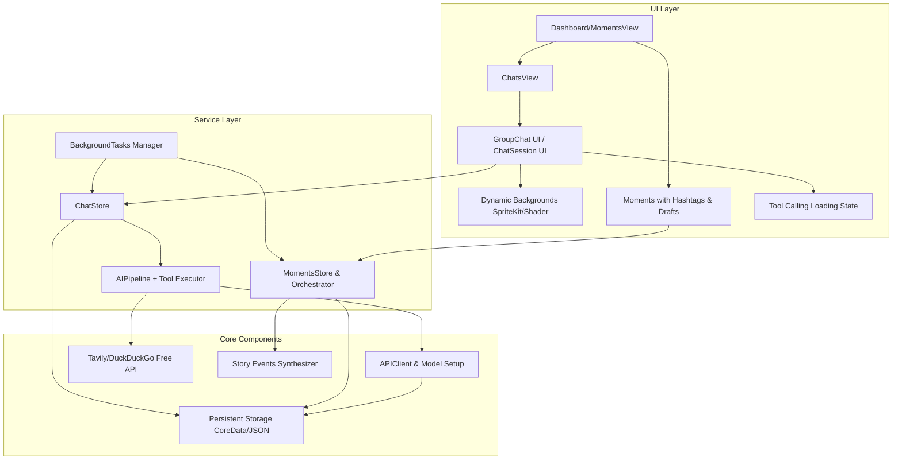
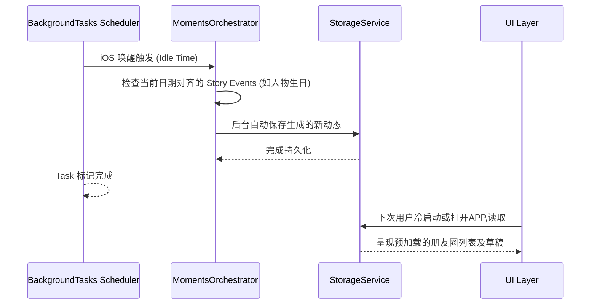

# DESIGN - Web To iOS Migration

## 1. 整体架构图 (Overall Architecture)



## 2. 分层设计和核心组件

本次移植保留原来的 Clean Architecture，并在 `Features/` `Services/` 以及 `Models/` 层注入新功能。

### 2.1 Model 层 (Data Contracts)
- `ChatSession.swift`: `personaId: String` => `personaIds: [String]`, 引入是否群聊属性 `isGroup: Bool`, 新增 `groupName: String?`。
- `ChatMessage.swift`: 添加 `toolCalls: [ToolCall]?` 字段表示该消息包含正在执行的第三方任务。
- `MomentPost.swift`: 加入 `hashtag: [String]?`, 且可能需要新的 `Draft` 枚举用以单独储存草稿机制。

### 2.2 UI 层 (Views)
- **群组头像系统 (Group Avatar Component)**: 取代单头像排列在 `ChatsView`, 采用最多四宫格网格堆叠的自定义组件。
- **Tool Calling Indicator**: 聊天流内展示代码解析图标或搜索放大镜转圈动画。
- **SpriteKit 动画背景层**: 封装 `ViewModifier` 或直接作为底部 `ZStack` 内容的 `BackgroundNodeView`。处理粒子的声明生命周期及陀螺仪。

### 2.3 Service 层 (Business Logic)
- **ChatStore & AIPipeline**: `AIPipeline` 发送聊天时检查如果是在群聊上下文中，需要同时发送所有目标 AI 角色的性格 Prompt，将用户历史记录中的消息打上各个人物 Tag 防止混淆。
- **ToolExecutorService (新)**: 管理免费搜索或特定命令。向 `APIClient` 拦截请求并分析 `[TOOL: search]` 这类 Prompt。
- **MomentsOrchestrator**: 配合 `AppDelegate` / `SceneDelegate` 响应 `BGProcessingTaskRequest`，在晚间唤醒后台触发批量事件及生日检查，存入 `MomentsStore`。

## 3. 模块依赖关系与数据流走向



### 工具调用链路数据流
1. 用户输入在 `ChatView` (特别是针对特别 Task Agent)。
2. `AIPipeline` 构件发往大模型（如配置了 Function Calling 参数的 API）。
3. 得到返回值判断为调用工具 (Tool Call)。
4. `ToolExecutorService` 发起真正的网络请求 (免 API 搜索)。
5. 将结果塞回 `AIPipeline`，再次发给大模型进行汇总总结。
6. `ChatStore` 更新最终消息，`ChatView` 展示最终总结与来源气泡。

## 4. 接口契约规范 (Contract Definition)

### ChatSession 迁移版规范
```swift
struct ChatSession: Identifiable, Codable {
    var id: String
    var title: String? // 用于群聊显式命名
    let personaIds: [String] // 替代旧的 personaId
    var isGroup: Bool { personaIds.count > 1 }
    var messages: [ChatMessage]
    // ...
}
```

### ReAct Tool Executor (协议)
```swift
protocol ToolExecutor {
    var name: String { get }
    var description: String { get }
    func execute(arguments: [String: Any]) async throws -> String
}

class SearchTool: ToolExecutor {
    // 免费外部 API 提取并转化
}
```

## 5. 异常处理策略

- **后台调度任务异常**:
  利用系统 `Task.isCancelled` 的特性实时监控后台被中止的风险。若后台在执行复杂文本生成的过程中被系统回收，标记 `unfinishedTask` 在下次 `AppActive` 期间通过异步再次补偿生成。如果在群聊状态下某位AI响应失败或Timeout，则提供友好的UI错误提示（如微信红色感叹号），而不阻塞其它的AI发言流程。
- **持久化失败与降级**: CoreData 或 JSON 重排架构变化较大，确保采用强一致性的 Migration 体系。如解码新版 `ChatSession` 失败回到空状态并备份原有文件，以防止老用户升级直接清空所有聊天记录。
