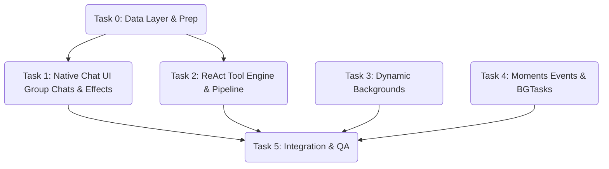

# TASK - Web To iOS Migration

本阶段基于设计的架构规范和边界，将功能拆解为高度独立并自带验证条件与依赖契约的原子化任务。

## 0. 工程准备与数据层迁移 (Data Layer & Prep)
- **依赖**: 无
- **输入**: 旧版 `ChatSession` (含单个 `personaId`).
- **输出**: 新版本容错兼容的 `ChatSession` 序列化/反序列化逻辑 (`personaIds: [String]`, `isGroup: Bool`)。
- **约束**: 本地已存在用户的聊天列表，迁移必须进行前/后向兼容。
- **验收**: 当原版单聊会话加载时，数据被无损正确转化为数组形式仅包含一人的会话列表，不闪退或引发 Decoding Error。

## 1. 原生聊天组件与交互重写 (Native Chat UI & Interactions)
- **依赖**: 任务 0 (数据层)。
- **输入**: 更新的 UI 与 ViewModel。
- **输出**: 支持多人的 `GroupAvatarView` 组件，以及更新后的会话页面 (`ChatsView`)。
- **约束**: SwiftUI 性能。支持 `ScrollViewReader` 或 SwiftUI 新的 `ScrollPosition` 的自动底部吸附效果。
- **验收**: 可视打字指示器 `TypingIndicator` 实现真实动态跳动并具备最小等待延迟，且在会话页面上可直接区分出多头像的群组界面与单聊的头像。

## 2. API Pipeline 与 ReAct 工具引擎 (Tool Execution & Group AI Setup)
- **依赖**: 任务 1，现有的 `APIClient.swift`。
- **输入**: 配置文件或免费搜索 API Endpoint。
- **输出**: 可被 Task AI Agent 引用的 `ToolExecutorService` 并解析特殊的 `[TOOL: x]` 回调循环逻辑。群聊 Prompt 生成器。
- **约束**: 使用 `URLSession` 实现非阻塞请求，异常及时降级呈现。
- **验收**: 测试与 `agent-coder` 等特定角色对话，检查在日志中系统是否进入工具触发循环并展示中间步骤于界面，群聊能按照性格配置自然发送多角色提示词。

## 3. 高性能动态背景视图系统 (Immersive Backgrounds & Shaders)
- **依赖**: 无(纯视图层开发，可并行)。
- **输入**: 背景配置(时间条件，如 Day/Night，光追或粒子属性)。
- **输出**: `DynamicBackgroundView` (利用 `SpriteKit` / Metal / Canvas / 陀螺仪 CoreMotion 映射)。
- **约束**: 严格控制内存占用，GPU开销与发热限制，动画停止需跟随视图生命周期休眠。
- **验收**: 设置页面或背景切换页面可视展现出如极光、流星或下雪的粒子动画系统，随手机晃动产生视差背景位移。

## 4. 后台任务调度与朋友圈事件编排 (BackgroundTasks & Moments Orchestration)
- **依赖**: 现有的 `MomentsStore` 及 Core Location / 日期判断组件。
- **输入**: AI 角色的设定数据库（生日/人设地理位置偏好），及时间触媒。
- **输出**: AppDelegate / App 自带的 `BGAppRefreshTask` / `BGProcessingTask` 注册点。
- **约束**: 必须符合 iOS 后台唤醒的严苛政策。
- **验收**: 可在模拟器 (通过 Developer debug 后台触发) 中验证处于锁屏期间系统自动将符合条件的角色发朋友圈保存到存储内；当用户打开应用时，立即可见新的 AI 动态且不卡主线程。并且支持“草稿(Draft)”缓存存取及 Hashtag 选择过滤分类。

## 5. 项目整合与测试 (Integration & Testing)
- **依赖**: 以上 1-4 任务全部完成。
- **输入**: 功能测试点及完整代码库。
- **输出**: 交付可直接安装与无错运行的 iOS `0.2.7-Equivalent`。
- **约束**: XCTest / 断言所有新增功能边界条件通过。
- **验收**: 所有旧有功能回退测试通过；新版功能完整度达标。

---

## 依赖关系图

